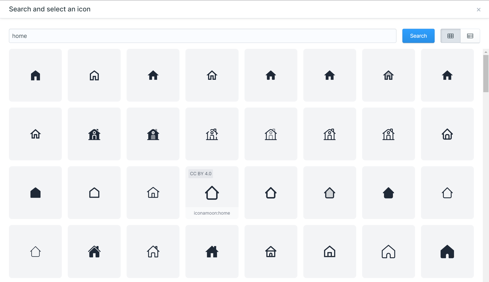

# Statamic Iconify

A Statamic plugin for the fantastic [Iconify](https://iconify.design/) framework.

This plugin gives you an Iconify fieldtype in Statamic where you can search and pick an icon from the huge icon library that Iconify provides.



## Installation

Install this plugin using composer.

```cli
composer require eminos/statamic-iconify
```

## Features

- Search the library of Iconify icons. 
- Over 150 000 open source icons that are loaded on demand.
- Uses Iconify's API. (Always updated icon sets)
- You can choose to only store the selected icon's name, and load it on demand, or store the icon as "SVG data" and use the provided `{{ iconify }}` antlers tag to generate an SVG.

## Usage

Depending on how you chose to store the icon, you have a few options for rendering it on the frontend.

### Storing only the **icon name**.
You can use any of Iconifys methods/components to display the icon in the frontend.
Here is an example with their web component that fetches the icon on demand through their API.

```html
<iconify-icon icon="{{ iconify_field }}"></iconify-icon>
```

Read more about how you can use the icons in the [Iconify usage documentation](https://iconify.design/docs/usage/).

### Storing the icon as **SVG Data**.

If you store the icon as "SVG Data" you can render the SVG using the provided Antlers Tag.
The obvious advantage to store the icon as SVG Data (instead of only the icon name) is that there are no more API calls to Iconify after you have picked the icon. The necessary data to render the icon is stored in your field.

```html
{{ iconify:icon_field }}
```
would render:
```html
<svg xmlns="http://www.w3.org/2000/svg" width="1em" height="1em" viewBox="0 0 24 24">
    <path fill="currentColor" d="M12 3L1 9l4 2.18v6L12 21l7-3.82v-6l2-1.09V17h2V9L12 3zm6.82 6L12 12.72L5.18 9L12 5.28L18.82 9zM17 15.99l-5 2.73l-5-2.73v-3.72L12 15l5-2.73v3.72z"/>
</svg>
```

You can also add other attributes and/or override the icon's default attributes **width**, **height** and **viewBox**.

```html
{{ iconify:icon_field class="text-xl" }}
```


## TODO

- ~~Make the search modal nicer.~~
- ~~Save the SVG when you pick an icon.~~
- ~~Statamic Tag to render the icon (on demand or saved SVG).~~
- More filtering options. For example limit to specific icon vendors or licences.

## License

The MIT License (MIT). Please see [License File](LICENSE.md) for more information.