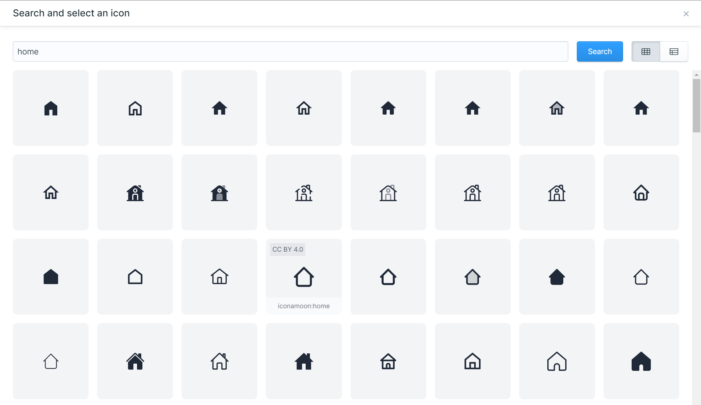

# Statamic Iconify

A Statamic plugin for the fantastic [Iconify](https://iconify.design/) framework.

This plugin gives you an Iconify fieldtype in Statamic where you can search and pick an icon from the huge icon library that Iconify provides.



## Installation

Install this plugin using composer.

```cli
composer require eminos/statamic-iconify
```

## Statamic support

| Statamic version | Addon version | Addon branch |
| --- | --- | --- |
| Statamic 5 | `1.x` | `1.x` |
| Statamic 6 | `2.x` | `main` |

## Features

- Search the library of Iconify icons.
- Over 200,000 open source icons loaded on demand.
- Uses Iconify's API (always updated icon sets).
- **Filter by icon set, category, or license** — at the global config level or per-field.
- Global config file to lock down allowed icon sets site-wide.
- Dark mode support.
- Store as icon name (load on demand) or SVG data (no API calls on frontend).
- Antlers tag to render stored SVG icons.

## Configuration

Publish the config file:

```cli
php artisan vendor:publish --tag=statamic-iconify-config
```

This creates `config/statamic-iconify.php` where you can set global restrictions:

```php
return [
    // Only allow these icon sets (empty = all)
    'allowed_prefixes' => ['mdi', 'tabler', 'heroicons', 'ph'],

    // Only allow icon sets from these categories (empty = all)
    // Available: Material, UI 24px, UI 16px / 32px, UI Multicolor,
    // UI Other / Mixed Grid, Thematic, Emoji, Logos, Flags / Maps,
    // Animated Icons, Archive / Unmaintained
    'allowed_categories' => [],

    // Only allow icon sets with these licenses (empty = all)
    // e.g. 'MIT', 'Apache 2.0', 'CC BY 4.0'
    'allowed_licenses' => [],

    // Default storage format for new fields
    'default_store_as' => 'name',
];
```

### Field-level configuration

Each Iconify field in your blueprints can further narrow the available icons:

- **Icon Sets** — Multi-select dropdown of available icon sets (filtered by global config)
- **Category** — Single select dropdown of icon set categories
- **Licenses** — Multi-select dropdown of license types
- **Store as** — Icon name or SVG data

Field-level settings can only narrow within what the global config allows, never widen.

## Usage

Depending on how you chose to store the icon, you have a few options for rendering it on the frontend.

### Storing only the **icon name**

You can use any of Iconify's methods/components to display the icon in the frontend.
Here is an example with their web component that fetches the icon on demand through their API.

```html
<iconify-icon icon="{{ iconify_field }}"></iconify-icon>
```

Read more about how you can use the icons in the [Iconify usage documentation](https://iconify.design/docs/usage/).

### Storing the icon as **SVG Data**

If you store the icon as "SVG Data" you can render the SVG using the provided Antlers Tag.
The advantage is that there are no API calls to Iconify after you have picked the icon — the data to render the icon is stored in your field.

```html
{{ iconify:icon_field }}
```

renders:

```html
<svg xmlns="http://www.w3.org/2000/svg" width="1em" height="1em" viewBox="0 0 24 24">
    <path fill="currentColor" d="M12 3L1 9l4 2.18v6L12 21l7-3.82v-6l2-1.09V17h2V9L12 3z..."/>
</svg>
```

You can also add attributes and/or override the icon's defaults:

```html
{{ iconify:icon_field class="text-xl" aria-label="Home icon" }}
```

## Testing

```bash
# PHP tests (Pest)
./vendor/bin/pest

# JavaScript tests (Vitest)
npm run test
```

## License

The MIT License (MIT). Please see [License File](LICENSE.md) for more information.
